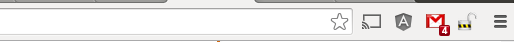
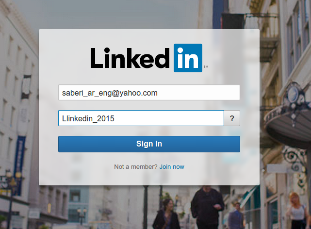
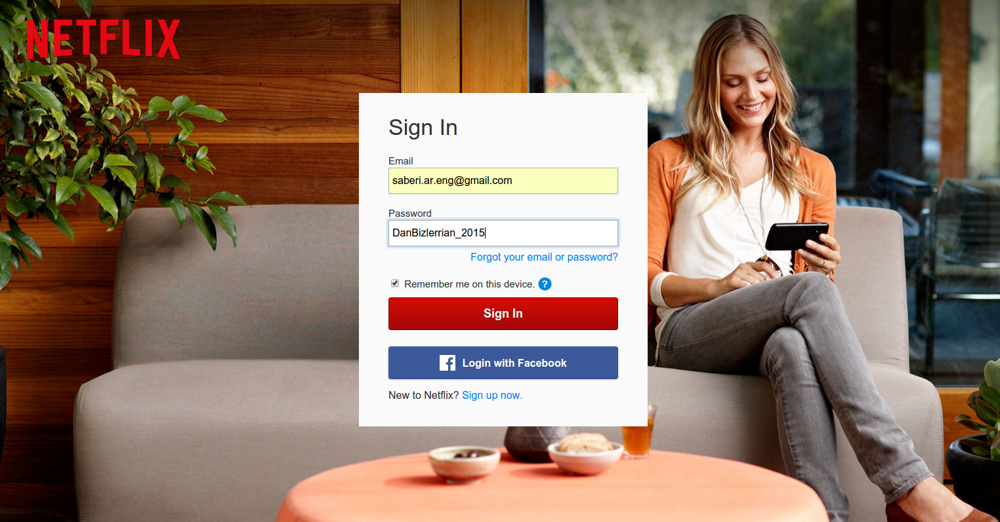

# Chrome Extension: Password Revealer V 0.1
With this Chrome extension all of input fields are text type instead of password type.

---
**[Get Started](https://github.com/alireza-saberi/chromeExtension_passwordRevealer) |**
**[Resources](https://github.com/alireza-saberi/chromeExtension_passwordRevealer/tree/master/codes) |**
**[Report an Issue](https://github.com/alireza-saberi/chromeExtension_passwordRevealer/issues)**

---

## Get Started
This Chrome extension was developed on hacking style during this weekend for personal purposes and fun after reading Google Chrome extension documents.
The type of this extension is browser action which means its icon sits beside the omnibox

To control DOM manipulation `content_script` matches with `<all_ulrs>` and `run_at` the `document_end`

## Installation
For installing this Chrome extension, after downlowding the source codes, go to setting > Extensions in Google Chrome. and put a checkmark beside the **Developer mode**  then **Load unpacked extension...** ta-da! :bowtie:, enjoy! :sparkles::sparkles::sparkles:\

Nothing is hidden now. Install it on other people computer and read their passwords. Bank account numbers, etc.
:japanese_goblin:

